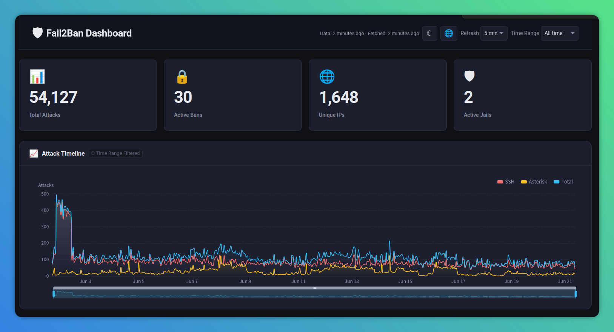
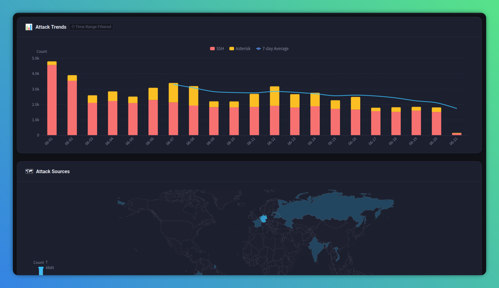
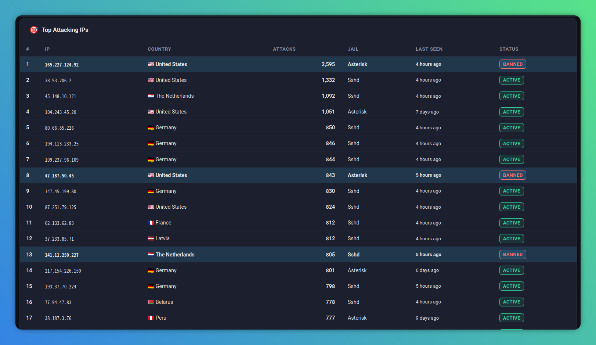
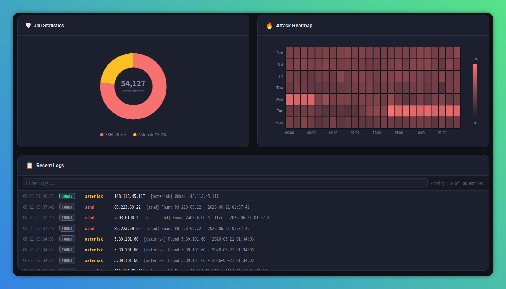
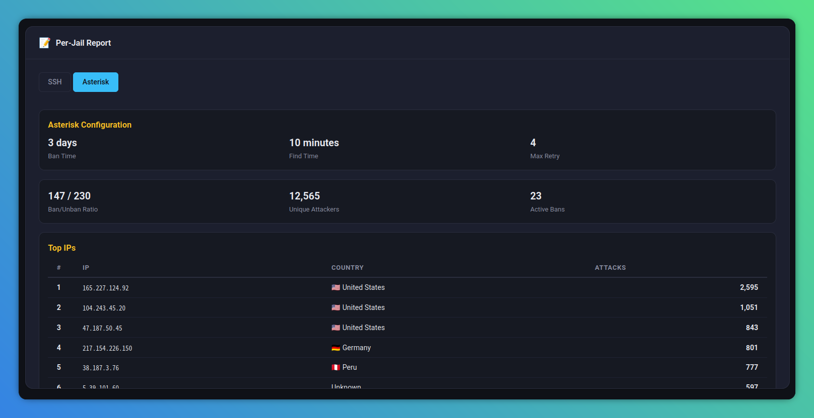

> [English](README.en.md) | 繁體中文

# Fail2Ban 即時儀表板

輕量級、零後端的 [Fail2Ban](https://github.com/fail2ban/fail2ban) 攻擊情報儀表板。以 Bash 腳本、Cron 排程及靜態 HTML/JavaScript 前端建構。將本機 `fail2ban.log` 日誌解析為聚合 JSON 資料，並以互動式圖表即時視覺化呈現。

## 概覽

[Fail2Ban](https://github.com/fail2ban/fail2ban) 即時儀表板將原始 Fail2Ban 日誌轉化為可操作的洞察資訊，無需後端伺服器、Node.js 執行環境或資料庫。架構設計刻意保持簡單：

- **Bash 腳本**負責解析與聚合日誌資料
- **Cron**排程定期更新資料集
- **靜態 HTML/JS**在任意現代瀏覽器中渲染儀表板
- **ECharts**驅動所有視覺化圖表（從 CDN 載入）

這使得儀表板可在任何 Linux 發行版上輕鬆部署，且依賴極少。

## 功能特色

### 儀表板區塊

1. **統計卡片** — 一目了然的關鍵指標：總攻擊次數、活躍封禁數、不重複 IP 數、活躍 Jail 數
2. **攻擊時間軸** — 平滑面積圖呈現攻擊頻率隨時間變化，支援依 Jail 別分類
3. **攻擊趨勢** — 堆疊長條圖搭配 7 日移動平均線
4. **世界地圖** — 分級設色地圖呈現攻擊來源的地理分佈
5. **攻擊 IP 排行** — 排名表格，含地理位置、Jail 歸屬及封禁狀態
6. **Jail 統計** — 圓餅圖呈現各 Jail 攻擊佔比
7. **攻擊熱力圖** — 小時 × 星期矩陣，揭示攻擊時間模式
8. **近期日誌** — 最近 100 筆日誌，支援基本文字篩選
9. **各 Jail 報告** — 每個 Jail 的詳細分析，可摺疊展開

### 其他能力

- **雙語介面** — 英文與繁體中文，涵蓋所有標籤、提示及訊息
- **深色/淺色主題** — 一鍵切換，狀態持久保存於 `localStorage`
- **可設定自動刷新** — 提供 1 分鐘、5 分鐘、10 分鐘或關閉等選項
- **時間範圍選擇器** — 篩選攻擊時間線與攻擊趨勢：最近 24 小時、最近 7 天、或全部時間
- **行動裝置響應式設計** — 手機單欄佈局，平板與桌面多欄格線佈局
- **穩健錯誤處理** — 當資料缺失、損毀或仍在載入時，提供從容的退回狀態

### 畫面截圖












## 系統需求

- Bash 4+
- `curl`
- `awk`（gawk 或 mawk）
- `jq`
- 網頁伺服器以提供靜態檔案（nginx、apache2、Caddy 或 `python3 -m http.server`）

支援的發行版：Debian/Ubuntu、CentOS/RHEL、Alpine、Arch。

## 安裝

```bash
sudo git clone https://github.com/a-lang/f2b-dashboard.git /opt/f2b-dashboard
cd /opt/f2b-dashboard
```

### 初始設定

```bash
mkdir -p web/data
chmod +x bin/f2b-parse.sh bin/f2b-geoip.sh

# 安裝 cron 排程（每 5 分鐘）
(crontab -l 2>/dev/null; echo "*/5 * * * * flock -n /tmp/f2b-parse.lock /opt/f2b-dashboard/bin/f2b-parse.sh /var/log/fail2ban.log /opt/f2b-dashboard/web/data && /opt/f2b-dashboard/bin/f2b-geoip.sh /opt/f2b-dashboard/web/data/dashboard.json /opt/f2b-dashboard/web/data/geo-cache.json") | crontab -
```

安裝完成後，以任意網頁伺服器提供`/opt/f2b-dashboard/web/`目錄，並在瀏覽器中開啟儀表板。

## 使用方式

### 解析日誌

```bash
bin/f2b-parse.sh [OPTIONS] [LOG_PATH] [OUTPUT_DIR]
```

| 參數 | 說明 | 預設值 |
|------|------|--------|
| `LOG_PATH` | fail2ban.log 路徑 | `/var/log/fail2ban.log` |
| `OUTPUT_DIR` | dashboard.json 輸出目錄 | `web/data` |

| 選項 | 說明 |
|------|------|
| `-h`, `--help` | 顯示求助訊息 |

```bash
bin/f2b-parse.sh                           # 使用預設值
bin/f2b-parse.sh /var/log/fail2ban.log     # 自訂日誌路徑
bin/f2b-parse.sh /var/log/fail2ban.log ./data  # 自訂路徑與輸出目錄
```

讀取 Fail2Ban 日誌檔（含輪替日誌`.1`、`.2`等）並輸出`dashboard.json`。處理所有事件類型：Found、Ban、Unban、Restore Ban、Ignore、already banned 及 DNS Lookup 事件。跳過`.gz`壓縮日誌。

### GeoIP 查詢

```bash
bin/f2b-geoip.sh [OPTIONS] [DASHBOARD_JSON] [GEO_CACHE_JSON]
```

| 參數 | 說明 | 預設值 |
|------|------|--------|
| `DASHBOARD_JSON` | dashboard.json 路徑 | `web/data/dashboard.json` |
| `GEO_CACHE_JSON` | geo-cache.json 路徑 | `web/data/geo-cache.json` |

| 選項 | 說明 |
|------|------|
| `--dry-run` | 僅預覽，不實際發送 API 請求 |
| `-h`, `--help` | 顯示求助訊息 |

```bash
bin/f2b-geoip.sh                           # 使用預設值
bin/f2b-geoip.sh --dry-run                 # 預覽模式，不發送 API
bin/f2b-geoip.sh /path/to/dashboard.json   # 自訂路徑
```

透過 [IP-API](http://ip-api.com) 查詢不重複公網 IP 的地理定位資料。維護本機`geo-cache.json`以避免重複 API 請求。遵守免費方案每分鐘 45 次請求的限制。私有 IP 與 IPv6 地址會跳過並適當標記。

### Cron 排程設定

預設情況下，cron 排程每 5 分鐘執行一次：

```
*/5 * * * * flock -n /tmp/f2b-parse.lock /opt/f2b-dashboard/bin/f2b-parse.sh /var/log/fail2ban.log /opt/f2b-dashboard/web/data && /opt/f2b-dashboard/bin/f2b-geoip.sh /opt/f2b-dashboard/web/data/dashboard.json /opt/f2b-dashboard/web/data/geo-cache.json
```

若要調整間隔，手動修改 crontab 中的 `*/5` 部分即可。

### 檢視儀表板

提供`/opt/f2b-dashboard/web/`目錄的靜態檔案服務並在瀏覽器中開啟。

#### Python（快速測試用，僅限本機或內部網路）

```bash
python3 -m http.server 8080 --directory /opt/f2b-dashboard/web
# http://localhost:8080
```

> 注意：Python 內建伺服器不適合正式環境、不支援安全標頭，且無 TLS。

#### Nginx

`/etc/nginx/sites-available/f2b-dashboard`：

```nginx
server {
    listen 80;
    server_name dashboard.example.com;
    root /opt/f2b-dashboard/web;
    index index.html;

    server_tokens off;

    location / {
        try_files $uri $uri/ =404;
    }

    # 禁止直接讀取原始資料（避免暴露內部 IP）
    location /data/ {
        deny all;
    }

    add_header X-Content-Type-Options "nosniff" always;
    add_header X-Frame-Options "DENY" always;
    add_header Referrer-Policy "no-referrer" always;
}
```

#### Apache

`/etc/apache2/sites-available/f2b-dashboard.conf`：

```apache
<VirtualHost *:80>
    ServerName dashboard.example.com
    DocumentRoot /opt/f2b-dashboard/web

    ServerSignature Off
    ServerTokens Prod

    <Directory /opt/f2b-dashboard/web>
        Options -Indexes
        AllowOverride None
        Require all granted
    </Directory>

    # 禁止直接讀取原始資料（避免暴露內部 IP）
    <Directory /opt/f2b-dashboard/web/data>
        Require all denied
    </Directory>

    Header always set X-Content-Type-Options "nosniff"
    Header always set X-Frame-Options "DENY"
    Header always set Referrer-Policy "no-referrer"
</VirtualHost>
```

#### Lighttpd

`/etc/lighttpd/conf-available/10-f2b-dashboard.conf`：

```lighttpd
$HTTP["host"] == "dashboard.example.com" {
    server.document-root = "/opt/f2b-dashboard/web"
    server.tag = ""

    dir-listing.activate = "disable"

    # 禁止直接讀取原始資料（避免暴露內部 IP）
    $HTTP["url"] =~ "^/data/" {
        url.access-deny = ("")
    }

    setenv.add-response-header = (
        "X-Content-Type-Options" => "nosniff",
        "X-Frame-Options" => "DENY",
        "Referrer-Policy" => "no-referrer"
    )
}
```

#### 安全性說明

上述設定涵蓋以下安全措施：

- **目錄列表關閉**（`-Indexes` / `dir-listing.activate = "disable"`）— 防止暴露檔案結構
- **隱藏伺服器版本**（`server_tokens off` / `ServerTokens Prod` / `server.tag = ""`）— 減少 fingerprinting
- **`X-Content-Type-Options: nosniff`** — 防止 MIME 類型嗅探攻擊
- **`X-Frame-Options: DENY`** — 防止點擊劫持
- **`Referrer-Policy: no-referrer`** — 不洩漏來源頁面路徑
- **`data/` 目錄拒絕對外存取** — 保護 `dashboard.json` 中的原始 IP 資料

## 設定

編輯專案根目錄的`web/js/config.js`以自訂設定：

| 欄位 | 預設值 | 說明 |
|---|---|---|
| `logPath` | `/var/log/fail2ban.log` | 活躍 Fail2Ban 日誌檔路徑 |
| `refreshInterval` | `300000` | 前端輪詢間隔（毫秒，預設 5 分鐘） |
| `dataPath` | `data/` | `web/`內資料目錄的相對路徑 |
| `maxRotatedFiles` | `10` | 最多處理的輪替日誌檔數量（`.1`、`.2`等） |
| `geoApiUrl` | `http://ip-api.com/json/` | GeoIP API 基礎 URL |
| `geoApiDelay` | `1.4` | API 請求間隔秒數（免費方案每分鐘 45 次） |

## 檔案結構

```
.
├── bin/
│   ├── f2b-parse.sh      # 日誌解析器與聚合腳本
│   └── f2b-geoip.sh      # GeoIP 查詢（含快取）
├── web/
│   ├── index.html        # 單頁儀表板
│   ├── css/
│   │   ├── theme.css     # 深色/淺色 CSS 變數
│   │   └── style.css     # 佈局與元件樣式
│   ├── js/
│   │   ├── app.js        # 應用程式控制器
│   │   ├── charts.js     # ECharts 渲染邏輯
│   │   ├── i18n.js       # 國際化翻譯模組
│   │   ├── utils.js      # 工具函式
│   │   └── config.js     # 使用者設定
│   ├── i18n/
│   │   ├── en.json       # 英文翻譯
│   │   └── zh.json       # 繁體中文翻譯
│   └── data/
│       ├── dashboard.json    # 生成的聚合資料
│       └── geo-cache.json    # GeoIP 快取
├── README.md           # 說明文件（繁體中文）
└── README.en.md        # 說明文件（英文）
```

## 架構

```
fail2ban.log ──┐
fail2ban.log.1─┼──► f2b-parse.sh ──► dashboard.json ──┐
fail2ban.log.2─┘                                      ├──► 瀏覽器
                                                      │
                    f2b-geoip.sh ◄── IP-API (HTTP) ───┘
                           │
                           ▼
                     geo-cache.json
```

1. **f2b-parse.sh** 讀取`fail2ban.log`及輪替檔案，聚合事件後以原子性寫入（先寫暫存檔再改名）寫入`dashboard.json`。
2. **f2b-geoip.sh** 從`dashboard.json`讀取不重複 IP，向 IP-API 查詢未快取的公網 IP，再將地理定位資料注入回`dashboard.json`。
3. **Cron** 以設定間隔執行兩支腳本，以`flock`防止重疊執行。
4. **瀏覽器** 依`web/js/config.js`設定的間隔輪詢`dashboard.json`。
5. **ECharts** 直接從 JSON 資料渲染所有圖表，無需額外轉換。

## 疑難排解

### 缺少 jq、curl 或 awk

請確認已安裝`curl`、`awk`及`jq`。各發行版安裝指令：

- Debian/Ubuntu: `sudo apt install curl gawk jq`
- CentOS/RHEL: `sudo yum install curl gawk jq`
- Alpine: `sudo apk add curl gawk jq`
- Arch: `sudo pacman -S curl gawk jq`

### 日誌檔權限不足

Cron 排程以安裝使用者的身份執行。請確認該使用者對`/var/log/fail2ban.log`及輪替檔案有讀取權限。你可能需要將使用者加入`adm`或`log`群組。

### 提供儀表板時的 CORS 問題

若瀏覽器主控台出現 CORS 錯誤，請確認網頁伺服器已設定允許同源的`GET`請求。多數靜態檔案伺服器預設即處理此問題。若直接以`file://`協定開啟`index.html`，現代瀏覽器可能阻擋`fetch`請求。請始終透過 HTTP 提供`web/`目錄。

### IP-API 速率限制

免費方案每分鐘允許 45 次請求。腳本在每次請求間強制等待 1.4 秒。若看到「未知」地理位置，請稍候數分鐘讓 cron 排程追上進度。已快取的 IP 不會重複查詢。

### 儀表板空白（無日誌資料）

若儀表板載入但顯示「--」或「載入資料中...」，請檢查：

- Fail2Ban 確實正在記錄至`web/js/config.js`中設定的路徑
- Cron 排程正在運行（`crontab -l`）
- `web/data/dashboard.json`存在且為有效 JSON（`jq . web/data/dashboard.json`）
- 至少手動執行過一次解析：
  ```bash
  bin/f2b-parse.sh /var/log/fail2ban.log web/data
  bin/f2b-geoip.sh web/data/dashboard.json web/data/geo-cache.json
  ```

## 解除安裝

```bash
# 移除 cron 排程
crontab -l 2>/dev/null | grep -v "f2b-parse.sh" | grep -v "f2b-geoip.sh" | grep -v "^# f2b-dashboard" | crontab -

# 清理鎖定檔
rm -f /tmp/f2b-parse.lock

# 選擇性刪除資料檔
rm -f /opt/f2b-dashboard/web/data/dashboard.json
rm -f /opt/f2b-dashboard/web/data/geo-cache.json
```

## 授權條款

MIT
